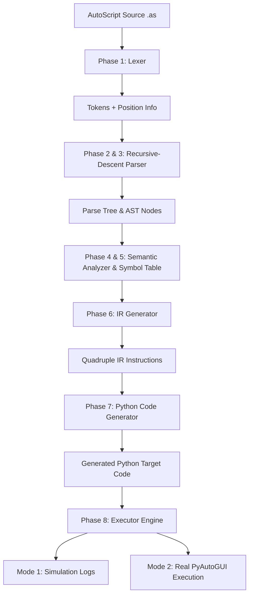

# AutoScript Compiler – A Domain-Specific Automation Language Compiler

> **Academic Compiler Design Project**  
> Demonstrating complete compiler phases for a custom Domain-Specific Language (DSL) targeting browser and GUI automation (`webbrowser`, `time`, `pyautogui`).

---

## 1. Problem Statement
Writing automation scripts directly in Python requires boilerplate code (`webbrowser.open()`, `time.sleep()`, `pyautogui.press()`, `pyautogui.write()`) and exposes users to full programming complexity. Furthermore, in computer science education, understanding compiler construction requires practical, demonstrable implementations of lexical analysis, parsing, semantic validation, AST generation, symbol management, intermediate representation, target code generation, and diagnostic error output.

## 2. Motivation
AutoScript provides a concise, high-level automation language (`.as`) designed specifically for browser and desktop macro tasks. The AutoScript Compiler serves as a complete, working demonstration of classical compiler design principles transformed into an interactive web-based compiler IDE.

## 3. Objectives
- Implement a formal domain-specific programming language for browser/desktop automation.
- Demonstrate all 10 core phases of a production compiler pipeline.
- Provide interactive UI inspectors for Tokens, Parse Tree, AST, Semantic Analysis, Symbol Table, IR, Generated Python, and Execution Logs.
- Provide IDE-style error diagnostics with source snippet line highlighting and carets (`^^^`).
- Support two execution modes: Mode 1 (Safe Simulation trace) and Mode 2 (Real PyAutoGUI automation execution with safety fail-safes).

---

## 4. Compiler Architecture



---

## 5. AutoScript Language Specification

File Extension: `.as`

### Commands
- **`OPEN "URL"`**: Opens specified URL in the web browser.
- **`GAP NUMBER`**: Delays execution for N seconds (must be positive number).
- **`TYPE "TEXT"`**: Types specified text into active window.
- **`PRESS KEY [COUNT]`**: Presses specified key (`TAB`, `ENTER`, `ESC`, `SPACE`, `BACKSPACE`, `UP`, `DOWN`, `LEFT`, `RIGHT`, `SHIFT`, `CTRL`, `ALT`).
- **`LOOP NUMBER { statements }`**: Executes enclosed block N times (supports nested loops).
- **`SET IDENTIFIER = EXPR`**: Declares and assigns variable symbols.
- **Comments**: Single-line comments starting with `#` or `//`.

---

## 6. Formal Context-Free Grammar (EBNF)

```ebnf
Program         ::= StatementList EOF ;
StatementList   ::= { Statement } ;
Statement       ::= OpenStmt | GapStmt | TypeStmt | PressStmt | LoopStmt | SetStmt ;
OpenStmt        ::= "OPEN" Expression ;
GapStmt         ::= "GAP" Expression ;
TypeStmt        ::= "TYPE" Expression ;
PressStmt       ::= "PRESS" KeyName [ Expression ] ;
LoopStmt        ::= "LOOP" Expression "{" StatementList "}" ;
SetStmt         ::= "SET" Identifier "=" Expression ;
Expression      ::= StringLiteral | NumberLiteral | Identifier ;
KeyName         ::= "TAB" | "ENTER" | "ESC" | "SPACE" | "BACKSPACE"
                  | "UP" | "DOWN" | "LEFT" | "RIGHT" | "SHIFT" | "CTRL" | "ALT" ;
```

---

## 7. Project Structure

```
COMP_PROJ/
├── backend/
│   ├── ast/
│   │   └── nodes.py          # AST Node Hierarchy
│   ├── codegen/
│   │   └── python_generator.py # Python Target Code Generator
│   ├── errors/
│   │   └── compiler_errors.py  # Diagnostic Error Formatting & Carets
│   ├── executor/
│   │   └── executor.py       # Mode 1 (Simulation) & Mode 2 (Real Exec)
│   ├── ir/
│   │   └── ir_generator.py   # Quadruple/Instruction-based IR
│   ├── lexer/
│   │   ├── token.py          # TokenType Enum & Token Data Structure
│   │   └── lexer.py          # Lexical Analyzer with line/col tracking
│   ├── parser/
│   │   └── parser.py         # Recursive-Descent Parser & CST Generator
│   ├── semantic/
│   │   ├── symbol_table.py   # Symbol Table & Scope Management
│   │   └── analyzer.py       # Semantic Analyzer & Type Checker
│   ├── compiler.py           # Master Pipeline Orchestrator
│   └── main.py               # FastAPI REST Application Server
├── frontend/                 # React + Vite Compiler IDE UI
├── examples/                 # Sample AutoScript Programs (.as)
├── tests/                    # Pytest Unit & Integration Test Suite
├── docs/                     # Compiler Design Documentation
├── requirements.txt          # Python Dependencies
└── README.md                 # Project Manual
```

---

## 8. Installation & Setup

### Requirements
- Python 3.9+
- Node.js v18+ & npm

### Install Python Dependencies
```powershell
pip install -r requirements.txt
```

### Install Frontend Dependencies
```powershell
cd frontend
npm install
cd ..
```

---

## 9. Running the Application

### Option A: Running the Backend API
Start the FastAPI compiler backend on `http://127.0.0.1:8000`:
```powershell
python -m uvicorn backend.main:app --reload --port 8000
```

### Option B: Running the Frontend IDE
Start the React + Vite frontend server on `http://localhost:5173`:
```powershell
cd frontend
npm run dev
```

Open `http://localhost:5173` in your browser to access the AutoScript Compiler IDE.

---

## 10. Running Tests

Run the complete compiler test suite using `pytest`:
```powershell
python -m pytest
```

Output:
```
tests/test_codegen.py .                                                  [  7%]
tests/test_end_to_end.py .                                               [ 15%]
tests/test_ir.py .                                                       [ 23%]
tests/test_lexer.py ....                                                 [ 53%]
tests/test_parser.py ...                                                 [ 76%]
tests/test_semantic.py ...                                               [100%]
============================= 13 passed in 0.12s ==============================
```

---

## 11. Example AutoScript Program

```autoscript
# AutoScript Login Automation Example
OPEN "https://practicetestautomation.com/practice-test-login/"
GAP 5
PRESS TAB 9
TYPE "Student"
PRESS TAB
TYPE "Password123"
PRESS ENTER

LOOP 3 {
    PRESS TAB
}
```

### Generated Target Python Code:
```python
# AutoScript Generated Python Code
import webbrowser
import time
import pyautogui

pyautogui.FAILSAFE = True

webbrowser.open('https://practicetestautomation.com/practice-test-login/')
time.sleep(5)
pyautogui.press('tab', presses=9)
pyautogui.write('Student')
pyautogui.press('tab')
pyautogui.write('Password123')
pyautogui.press('enter')
for _ in range(3):
    pyautogui.press('tab')
```

---

## 12. Future Enhancements
- Support conditional control flow (`IF / ELSE`).
- Support mouse click coordinates (`CLICK X Y`).
- Custom user function definitions (`DEF function_name { ... }`).
